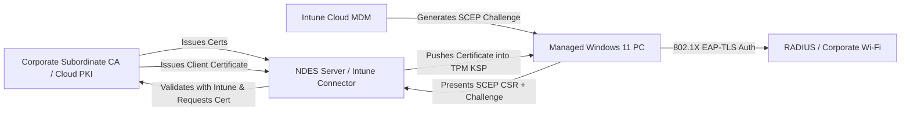
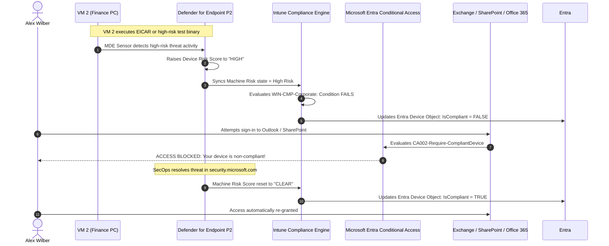

# MD-102: Endpoint Administrator Master Lab Guide & Blueprint

**Project:** Microsoft 365 Modern Endpoint Administrator Master Lab & Blueprint  
**Target Certification:** Microsoft Certified: Endpoint Administrator Associate (Exam MD-102)  
**Platform Stack:** Microsoft Intune, Microsoft Entra ID, Microsoft Defender for Endpoint, Windows 11 Enterprise  
**Subscription Model:** Microsoft 365 E5 (Tenant Total: 25 Licenses | Active Allocated Budget: 20 Licenses | Safety Reserve: 5 Licenses)  
**Architecture:** Cloud-Native Zero Trust, Hybrid Transition, Group-Based Licensing, Automated Provisioning  

---

## 1. Engineering Philosophy & Methodology

This lab guide is engineered with a **Zero-Compromise, Production-First Architecture**. It serves as both an exhaustive hands-on syllabus for **Exam MD-102: Managing and Securing Microsoft 365 Endpoints by using Intune** and an enterprise-grade standard operating procedure (SOP) for modern endpoint architects.

The core learning and implementation framework follows the **Six-Stage Diagnostic Cycle**:

```text
[ 1. Design & Build ] ──> [ 2. Telemetry & Validate ] ──> [ 3. Failure Injection ]
        ▲                                                               │
        │                                                               ▼
[ 6. Hardening & SOP ] <── [ 5. Remediation & Rollback ] <── [ 4. Root Cause Analysis ]
```

---

## 2. Licensing Strategy & Strict 20/5 Budget Architecture

In enterprise tenant environments and Microsoft 365 Developer / Trial subscriptions, the tenant license pool is constrained to **25 Microsoft 365 E5 Licenses**.

To ensure 100% tenant resilience, zero license exhaustion, and no admin lockouts during automated enrollments, this lab enforces a strict **20-Seat Active Allocated Budget** with an unassigned **5-Seat Safety Reserve Buffer**.

### 2.1 25-Seat License Budget Allocation Table

| Allocation Category | Identity / Account | UPN / Object | Assigned Workloads & Security Context | Seats |
|---|---|---|---|---|
| **Tier-0 Admin** | Global Emergency Access | `admin-global-emergency@<tenant>.onmicrosoft.com` | Break-Glass only; Cloud-only; Excluded from all CA; PIM/FIDO2 | **1** |
| **Tier-1 Admin** | Intune Principal Architect | `admin-intune@<tenant>.onmicrosoft.com` | Intune Administrator via Entra ID PIM (Eligible JIT) | **1** |
| **Tier-1 Admin** | Security Operations Lead | `admin-security@<tenant>.onmicrosoft.com` | Security Administrator / Defender SecOps via PIM | **1** |
| **Corporate Persona** | Adele Vance (IT) | `adele.vance@<tenant>.onmicrosoft.com` | Windows 11 Corp PC (VM 1); Pilot update ring; EPM user | **1** |
| **Corporate Persona** | Alex Wilber (Finance) | `alex.wilber@<tenant>.onmicrosoft.com` | Windows 11 Corp PC (VM 2); BitLocker escrow; LAPS; Custom Compliance | **1** |
| **Corporate Persona** | Megan Bowen (HR) | `megan.bowen@<tenant>.onmicrosoft.com` | Windows 11 Autopilot PC (VM 3); Autopilot v2 Device Prep; M365 Apps | **1** |
| **BYOD Persona** | Joni Sherman (Sales) | `joni.sherman@<tenant>.onmicrosoft.com` | BYOD Windows / Android; MAM-WE; App Protection Policies | **1** |
| **Mobile Persona** | Diego Siciliani (Field) | `diego.s@<tenant>.onmicrosoft.com` | Android Enterprise Work Profile / Dedicated Kiosk (AVD Emulator) | **1** |
| **Executive Persona** | Miriam Graham (Exec) | `miriam.g@<tenant>.onmicrosoft.com` | macOS / iOS; Platform SSO; FileVault key escrow | **1** |
| **Specialized Test** | Intune Helpdesk Operator | `intune-operator@<tenant>.onmicrosoft.com` | Restricted RBAC Helpdesk role; Scope Tags testing (`Tag-Finance`) | **1** |
| **Specialized Test** | Security Operator | `security-operator@<tenant>.onmicrosoft.com` | Restricted Defender MDE incident responder | **1** |
| **Specialized Test** | Shared Kiosk Account | `kiosk-user@<tenant>.onmicrosoft.com` | Multi-user shared device & Assigned Access testing | **1** |
| **Specialized Test** | Pilot User 01 | `pilot.user01@<tenant>.onmicrosoft.com` | Pre-production testing for Win32 apps & Feature Updates | **1** |
| **Specialized Test** | Pilot User 02 | `pilot.user02@<tenant>.onmicrosoft.com` | Quality update expedited zero-day testing | **1** |
| **Staging Buffer** | Dynamic Test Users (1–6)| `staging.user01-06@<tenant>.onmicrosoft.com` | Temporary accounts used during multi-device provisioning | **6** |
| **SUBTOTAL ACTIVE** | | | **Assigned via `GRP-LIC-M365-E5`** | **20** |
| **SAFETY RESERVE** | *Unassigned Reserve* | *No Assigned Identities* | **Strict 5-seat emergency safety buffer (No Lockouts)** | **5** |
| **TOTAL TENANT POOL**| | | **Microsoft 365 E5 Complete Stack** | **25** |

### 2.2 Group-Based Licensing (GBL) Automation Rules

Direct user license assignment is strictly prohibited in this architecture to eliminate configuration drift.

1. Navigate to **Microsoft Entra admin center > Identity > Billing > Licenses > All products**.
2. Select **Microsoft 365 E5** > Click **Assign**.
3. Target Group: `GRP-LIC-M365-E5`.
4. Review enabled license options (Ensure *Intune*, *Entra ID P2*, *Defender for Endpoint P2*, and *Windows Enterprise* are enabled).
5. Verify that adding a user to `GRP-LIC-M365-E5` automatically provisions all licenses within 120 seconds.

---

## 3. Microsoft Entra ID Group Architecture & Naming Standards

```text
# Licensing Group
GRP-LIC-M365-E5

# Departmental User Groups (Static)
GRP-USR-IT
GRP-USR-FINANCE
GRP-USR-HR
GRP-USR-SALES
GRP-USR-FIELD
GRP-USR-EXCLUDE-CA

# Windows Device Groups (Static & Dynamic)
GRP-DEV-WIN-CORPORATE           # Static: All enterprise-owned Windows 11 endpoints
GRP-DEV-WIN-AUTOPILOT           # Dynamic: (device.devicePhysicalIDs -any (_ -contains "[ZTDID]"))
GRP-DEV-WIN-AUTOPILOT-V2        # Static: Assigned for Autopilot Device Preparation
GRP-DEV-WIN-PILOT               # Static: Ring 0 / Ring 1 early validation endpoints
GRP-DEV-WIN-PRODUCTION          # Static: Ring 2 broad enterprise production
GRP-DEV-WIN-SHARED              # Static: Multi-user shared / Kiosk PCs
GRP-DEV-BYOD                    # Dynamic: (device.deviceOwnership -eq "Personal")

# Cross-Platform Device Groups (Dynamic)
GRP-DEV-ANDROID-CORPORATE       # Dynamic: (device.deviceOSType -eq "Android") and (device.deviceOwnership -eq "Company")
GRP-DEV-IOS-CORPORATE           # Dynamic: (device.deviceOSType -eq "iOS") and (device.deviceOwnership -eq "Company")
GRP-DEV-MACOS-CORPORATE         # Dynamic: (device.deviceOSType -eq "macOS") and (device.deviceOwnership -eq "Company")
```

---

## 4. Virtualization Infrastructure Setup & Diagnostics

### 4.1 Hyper-V / VMware Workstation VM Preparation Matrix

| Specification | Corporate VM 1 (IT / Adele) | Corporate VM 2 (Finance / Alex) | Autopilot VM 3 (HR / Megan) |
|---|---|---|---|
| **VM Generation** | Generation 2 (UEFI) | Generation 2 (UEFI) | Generation 2 (UEFI) |
| **Virtual TPM (vTPM)** | **Enabled (TPM 2.0)** | **Enabled (TPM 2.0)** | **Enabled (TPM 2.0)** |
| **Secure Boot** | Enabled (Microsoft Windows) | Enabled (Microsoft Windows) | Enabled (Microsoft Windows) |
| **vCPU / RAM** | 2 vCPU / 4096 MB Dynamic | 2 vCPU / 4096 MB Dynamic | 2 vCPU / 4096 MB Dynamic |
| **Virtual Disk** | 80 GB VHDX (Thin Provisioned)| 80 GB VHDX (Thin Provisioned)| 80 GB VHDX (Thin Provisioned)|
| **Base Operating System** | Windows 11 Pro 23H2 / 24H2 | Windows 11 Pro 23H2 / 24H2 | Windows 11 Pro 23H2 / 24H2 |
| **Network Adapter** | Default Switch (NAT) | Default Switch (NAT) | Default Switch (NAT) |

### 4.2 Android Studio AVD Configuration (100% Free Mobile Testing)

1. Launch **Android Studio > Virtual Device Manager > Create Virtual Device**.
2. Hardware Profile: **Pixel 7** (Confirm Play Store logo is visible).
3. Target System Image: **Release Name: UpsideDownCake (Android 14.0, API Level 34, ABI: x86_64, with Google Play)**.
4. Launch Emulator > Sign in to test Google Account > Install **Intune Company Portal**.

---

# Phase 1: Tenant and Identity Foundation

## Lab 1: Hardened Tenant Setup, Branding & Emergency Break-Glass
*MD-102 Domain: Manage Identity and Access (10–15%)*

### Objective
Establish the primary cloud tenant infrastructure, deploy company branding, and build an immutable break-glass emergency administration procedure.

### Tasks
- [ ] Verify **MDM Authority** is set to *Microsoft Intune*.
- [ ] Configure **Company Branding** under **Entra ID > User experiences > Company branding**:
  - Banner logo (280x60 px PNG), Square logo (240x240 px PNG), Sign-in page background (1920x1080 px).
  - Sign-in page text: *"Authorized Contoso Personnel Only. All activities are monitored and audited."*
- [ ] Configure **Break-Glass Emergency Account** (`admin-global-emergency@<tenant>.onmicrosoft.com`):
  - Cloud-only identity (never synchronized from Active Directory).
  - Assigned **Global Administrator** role permanently.
  - Password: 32+ character cryptographically generated string stored in an enterprise physical safe.
  - Excluded from **ALL** Conditional Access policies.
  - Configure an Entra Log Analytics Alert to trigger an immediate incident notification whenever this UPN authenticates.

---

## Lab 2: Intune Role-Based Access Control (RBAC), Scope Tags & Administrative Units
*MD-102 Domain: Manage Identity and Access (10–15%)*

### Objective
Enforce least-privilege administrative access using Intune Built-in Roles, Custom Roles, Scope Tags, and Administrative Units (AUs).

### Tasks
- [ ] Create Scope Tags under **Intune > Tenant administration > Roles > Scope tags**:
  - `Tag-IT`
  - `Tag-Finance`
  - `Tag-HR`
- [ ] Create an **Administrative Unit (AU)** in Entra ID named `AU-Finance-Operations`:
  - Members: Alex Wilber, Finance Windows VM 2.
- [ ] Configure Scoped Intune Role Assignment:
  - Assign built-in role **Help Desk Operator** to `intune-operator@<tenant>.onmicrosoft.com`.
  - Scope (Groups): `GRP-USR-FINANCE` and `GRP-DEV-WIN-CORPORATE`.
  - Scope (Tags): `Tag-Finance`.
- [ ] Create a **Custom Role** named `SecOps Policy Auditor`:
  - Permissions: Read Device Configurations, Read Compliance, Read Managed Devices, Read Audit Logs.
  - Block: Edit/Delete/Assign policies, Remote Wipe actions.
- [ ] **Validation:** Sign in as `intune-operator@<tenant>.onmicrosoft.com` and verify that non-Finance devices and IT policies are completely hidden from view.

---

## Lab 2B: Windows Subscription Activation (Pro $\rightarrow$ Enterprise Dynamic Step-Up)
*MD-102 Domain: Deploy Windows Client (25–30%)*

### Objective
Validate cloud-native operating system edition upgrade from Windows 11 Pro to Windows 11 Enterprise using M365 E5 user-based licensing without re-imaging or rebooting.

### Step-by-Step Execution:
1. On a clean Windows 11 Pro VM (VM 1), open elevated PowerShell before sign-in and execute:
   ```powershell
   Get-ComputerInfo | Select-Object WindowsProductName, WindowsEditionId, OsHardwareAbstractionLayer
   slmgr /dli
   ```
   *Expected Output: `Windows 11 Pro` / `Professional`.*
2. Sign in to the workstation with licensed user `alex.wilber@<tenant>.onmicrosoft.com`.
3. Wait 60–120 seconds for the Windows Subscription Activation service (`ClipSVC`) to poll Entra ID.
4. Execute validation in PowerShell:
   ```powershell
   Get-ComputerInfo | Select-Object WindowsProductName, WindowsEditionId
   slmgr /dli
   ```
   *Expected Output: `Windows 11 Enterprise` / `License Status: Licensed`.*

---

# Phase 2: Device Enrollment and Identity Lifecycle

## Lab 3: Device Identity Dissection (`dsregcmd /status`)
*MD-102 Domain: Manage Identity and Access (10–15%)*

### Objective
Analyze and validate the structural differences between Microsoft Entra Registered, Microsoft Entra Joined, and Microsoft Entra Hybrid Joined.

### Identity Types Architectural Comparison

| Parameter | Microsoft Entra Registered | Microsoft Entra Joined | Microsoft Entra Hybrid Joined |
|---|---|---|---|
| **Target Hardware** | BYOD / Personal PC, Mobile | Cloud-First Corporate PCs | Domain-Joined Legacy Active Directory PCs |
| **Join Mechanism** | Settings > Accounts > Work/School | Windows OOBE / Autopilot | AD GPO / Entra Connect Sync |
| **Primary Token** | Workplace PRT (App-scoped) | **Enterprise PRT (Device-scoped)** | Kerberos TGT + Enterprise PRT |
| **Local Admin Control** | Local user remains admin | Managed via Cloud LAPS / Entra Roles | Active Directory Domain Admins / GPO |

### Comprehensive `dsregcmd /status` Analysis Guide
Run `dsregcmd /status` in an elevated prompt. Verify the following critical output fields:

```text
+----------------------------------------------------------------------+
| Device State                                                         |
+----------------------------------------------------------------------+
             AzureAdJoined : YES
          EnterpriseJoined : NO
              DomainJoined : NO
               Device Name : CON-FIN-8821
                  DeviceId : 7a2b9c1d-3e4f-5a6b-7c8d-9e0f1a2b3c4d

+----------------------------------------------------------------------+
| SSO State                                                            |
+----------------------------------------------------------------------+
                AzureAdPrt : YES
       AzureAdPrtAuthority : https://login.microsoftonline.com/<TenantID>
      AcquirePrtDiagnostics: PRESENT
               OnPremTgt : NO (YES if Cloud Kerberos Trust is configured)
```

---

## Lab 4: Enrollment Restrictions, Corporate Identifiers & Auto-Cleanup Rules
*MD-102 Domain: Deploy Windows Client (25–30%)*

### Objective
Configure strict tenant enrollment boundaries, pre-stage corporate hardware identifiers, and automate stale device lifecycle retirement.

### Tasks
- [ ] Configure **MDM Automatic Enrollment Scope** under **Entra ID > Mobility (MDM and WIP) > Microsoft Intune**:
  - MDM User Scope: **All** (or `GRP-LIC-M365-E5`).
  - MAM User Scope: **None** *(Crucial: Setting both to All causes enrollment failures on Windows)*.
- [ ] Configure **Enrollment Platform Restrictions** under **Intune > Devices > Enrollment > Enrollment device platform restrictions**:
  - Windows: Block **Personally owned** devices. Allow **Corporate** only. Minimum OS build: `10.0.22631.0`.
  - Android: Block Android Device Administrator (Legacy). Allow Android Enterprise Work Profile.
  - iOS/macOS: Allow Corporate & BYOD.
- [ ] **Pre-Register Corporate Device Identifiers**:
  - Navigate to **Intune > Devices > Enrollment > Corporate device identifiers**.
  - Upload `CorporateHardwareIDs.csv` containing test VM Serial Numbers:
    ```csv
    Identifier,Manufacturer,Model,Type
    0000-0012-3456-7890,Microsoft Corporation,Hyper-V,SerialNumber
    VMware-42 1a 88 cc 99,VMware Inc.,Virtual Platform,SerialNumber
    ```
- [ ] Configure **Device Clean-Up Rules**:
  - Path: **Intune > Devices > Device clean-up rules**.
  - Set *Delete devices based on last check-in date*: **90 Days**.

---

# Phase 3: Modern Provisioning & Windows Autopilot

## Lab 5: Windows Autopilot User-Driven Deployment (Classic Hash)
*MD-102 Domain: Deploy Windows Client (25–30%)*

### Objective
Provision a corporate Windows 11 endpoint directly from OOBE using cloud-native Windows Autopilot and enforce an Enrollment Status Page (ESP).

### Step 1: Hardware Hash Extraction
At the Windows 11 Out-of-Box Experience (OOBE) language selection screen, press `Shift + F10` to open CMD:
```powershell
powershell.exe -ExecutionPolicy Bypass
Install-Script -Name Get-WindowsAutopilotInfo -Force
Get-WindowsAutopilotInfo -OutputFile C:\AutopilotHWID.csv -GroupTag "Finance-Laptops"
```
*(Import `C:\AutopilotHWID.csv` into **Intune > Devices > Enrollment > Windows Autopilot devices**).*

### Step 2: Configure Dynamic Group & Autopilot Profile
- [ ] Dynamic Device Group: `GRP-DEV-WIN-AUTOPILOT`
  ```text
  (device.devicePhysicalIds -any (_ -eq "[OrderID]:Finance-Laptops"))
  ```
- [ ] **Autopilot Deployment Profile (`WIN-AP-UserDriven-EntraJoin`)**:
  - Deployment mode: **User-Driven**
  - Join to Microsoft Entra ID as: **Microsoft Entra joined**
  - Microsoft Software License Terms (EULA): **Hide**
  - Privacy settings: **Hide**
  - Hide change account options: **Hide**
  - User account type: **Standard** *(Enforces least-privilege security)*
  - Device name template: `CON-FIN-%RAND:4%`
- [ ] **Enrollment Status Page (ESP) Configuration (`WIN-ESP-Corporate`)**:
  - Show app and profile installation progress: **Yes**
  - Block device use until all apps and profiles are installed: **Yes**
  - Block device use until these required apps are installed: **Microsoft 365 Apps, Company Portal, Edge, 7-Zip**
  - Allow users to reset device if installation error occurs: **Yes**
  - Time out error if installation exceeds: **45 minutes**

### Step 3: Deployment, Diagnostics & Failure Injection
- [ ] Boot VM 2, verify corporate branded login screen appears, sign in with `alex.wilber@<tenant>.onmicrosoft.com`.
- [ ] **Failure Injection Exercise:** Intentionally assign a broken Win32 app (e.g. non-existent install command) as a required blocker in ESP.
- [ ] Observe ESP failure screen: *"Installation failed: One or more required apps could not be installed."*
- [ ] Press `Shift + F10` and export full diagnostics:
  ```cmd
  mdmdiagnosticstool.exe -area Autopilot;DeviceEnrollment;DeviceProvisioning -cab C:\Temp\ESP_Diagnostics.cab
  ```
- [ ] Inspect `C:\ProgramData\Microsoft\IntuneManagementExtension\Logs\IntuneManagementExtension.log` to identify the failing app MSI/Win32 error code.

---

## Lab 5B: Windows Autopilot Device Preparation (Autopilot v2)
*MD-102 Domain: Deploy Windows Client (25–30%)*

### Objective
Deploy Windows 11 using Microsoft's next-generation **Autopilot Device Preparation** policy without uploading hardware hashes.

### Technical Comparison Matrix

| Attribute | Windows Autopilot (Classic) | Autopilot Device Preparation (v2) |
|---|---|---|
| **Hardware Hash Registration** | Required (CSV / OEM upload) | **Not Required** |
| **Group Targeting Mechanism** | Dynamic Device Group (Group Tag / ZTDID) | **Static Security Group** |
| **Join Type Support** | Microsoft Entra Join & Hybrid Entra Join | **Microsoft Entra Join Only** |
| **Service Principal RBAC** | Automatic | Requires `Intune Autopilot Confidential Client` role on group |
| **Status Page Architecture** | Classic ESP (Device / Account phases) | Real-time streamlined single status screen |

### Configuration Tasks
1. Create Static Security Group: `GRP-DEV-WIN-AUTOPILOT-V2`.
2. Grant Enterprise Application Permission:
   - In Entra ID, open `GRP-DEV-WIN-AUTOPILOT-V2` > Owners > Add Service Principal: **Intune Autopilot Confidential Client App**.
3. Create Device Preparation Policy under **Intune > Devices > Enrollment > Device preparation policies**:
   - Device group: Assign to `GRP-DEV-WIN-AUTOPILOT-V2`.
   - User account type: **Standard**.
   - Apps to install during setup: **Company Portal, Microsoft 365 Apps**.
   - Configuration scripts / profiles: Assign standard configuration baselines.
4. On a clean un-hashed VM (VM 3), boot to OOBE and sign in with `megan.bowen@<tenant>.onmicrosoft.com`. Verify seamless automated provisioning.

---

# Phase 4: Modern Configuration, GPO Migration & Certificates

## Lab 6: Settings Catalog Architecture & Assignment Filters
*MD-102 Domain: Manage Compliance and Device Policies (45–50%)*

### Objective
Build modular configuration profiles using Settings Catalog and target endpoints with Assignment Filters.

### Profile Architecture
```text
WIN-CFG-SettingsCatalog-OneDriveKFM
WIN-CFG-SettingsCatalog-EdgeHardening
WIN-CFG-DeliveryOptimization-BranchCache
```

### Tasks
- [ ] **OneDrive Known Folder Move (KFM) Policy (Settings Catalog)**:
  - Search Category: `OneDrive`
  - Setting 1: *Silently move Windows known folders to OneDrive* = **Enabled** (Tenant ID: `<Your-Tenant-ID>`).
  - Setting 2: *Prevent users from redirecting their Windows known folders to their PC* = **Enabled**.
  - Setting 3: *Silently sign in users to the OneDrive sync app with their Windows credentials* = **Enabled**.
- [ ] **Assignment Filter Creation**:
  - Navigate to **Intune > Tenant administration > Filters > Create (Windows 10 and later)**.
  - Filter Name: `Filter-Corporate-Win11`.
  - Rule:
    ```text
    (device.operatingSystemVersion -startsWith "10.0.22") and (device.deviceOwnership -eq "Company")
    ```
- [ ] Assign profile to `All Devices` with Filter mode: **Include filtered devices in assignment**.

---

## Lab 6B: Group Policy Analytics & Direct Migration
*MD-102 Domain: Manage Compliance and Device Policies (45–50%)*

### Objective
Ingest on-premises Active Directory GPO backups, analyze CSP compatibility, and migrate supported settings into Intune Settings Catalog profiles.

### Tasks
- [ ] Export an Active Directory GPO backup as XML using PowerShell:
  ```powershell
  Backup-GPO -Name "Corporate Baseline GPO" -Path "C:\GPOBackup"
  ```
- [ ] In Intune, navigate to **Devices > Manage devices > Group Policy analytics**.
- [ ] Click **Import** and upload the GPO `.xml` file.
- [ ] Analyze the **MDM Support Percentage**:
  - Identify CSP Mappings (e.g., `./Device/Vendor/MSFT/Policy/Config/SecurityProviders/...`).
  - Review unsupported legacy settings (e.g., deprecated WINS/NetBIOS settings).
- [ ] Click **Migrate** > Select supported settings > Generate profile `WIN-MIGRATED-GPO-Baseline` and assign to `GRP-DEV-WIN-CORPORATE`.

---

## Lab 6C: Enterprise PKI, SCEP/PKCS Certificates & Wi-Fi Profiles
*MD-102 Domain: Manage Compliance and Device Policies (45–50%)*

### Objective
Deploy Root CA certificates, deploy user/device authentication certificates via SCEP/PKCS, and configure an 802.1X Enterprise Wi-Fi profile.



### Configuration Tasks
- [ ] **Trusted Root Certificate Profile**:
  - Profile type: **Templates > Trusted certificate**.
  - Upload `ContosoRootCA.cer` > Destination Store: **Computer certificate store - Root**.
- [ ] **SCEP Client Certificate Profile**:
  - Profile type: **Templates > SCEP certificate**.
  - Certificate type: **User**.
  - Subject name format: `CN={{UserPrincipalName}}`
  - Subject Alternative Name (SAN): `User Principal Name (UPN)` = `{{UserPrincipalName}}`.
  - Key Storage Provider (KSP): **Enroll to TPM KSP if present, otherwise fail**.
  - Key usage: **Digital signature, Key encipherment**.
  - Key size: **2048**.
  - Root Certificate: Link to `ContosoRootCA.cer` profile.
- [ ] **Enterprise Wi-Fi Profile**:
  - Profile type: **Templates > Wi-Fi (Enterprise)**.
  - Wi-Fi name (SSID): `Contoso-Corp-Secure`.
  - EAP Type: **EAP - TLS**.
  - Root Certificate for server validation: Link to `ContosoRootCA.cer`.
  - Identity Certificate: Link to SCEP Client Certificate profile.

---

## Lab 7: Windows Hello for Business & Cloud-Native Windows LAPS
*MD-102 Domain: Manage Identity and Access (10–15%)*

### Objective
Implement biometric passwordless authentication and cloud-managed Local Administrator Password Solution (Windows LAPS) backed by Microsoft Entra ID.

### Tasks: Windows Hello for Business (WHfB)
- [ ] Configure tenant WHfB policy under **Intune > Devices > Enrollment > Windows Hello for Business**:
  - Use TPM: **Required**.
  - Minimum PIN length: **6 digits**.
  - Expiration: **180 days**.
  - Biometrics (Fingerprint / Facial Recognition): **Allowed**.
  - Enhanced Anti-Spoofing: **Required**.
  - Security keys for sign-in: **Enabled**.

### Tasks: Cloud-Native Windows LAPS
- [ ] Create LAPS policy under **Intune > Endpoint security > Account protection > Create policy (Windows LAPS)**:
  - Backup directory: **Backup the password to Microsoft Entra ID only**.
  - Password complexity: **Large letters + Small letters + Numbers + Special characters**.
  - Password length: **16 characters**.
  - Password age: **30 days**.
  - Administrator account name: `ContosoLocalAdmin`.
- [ ] Assign to `GRP-DEV-WIN-CORPORATE`.
- [ ] Sync VM 1 and verify local administrator management in PowerShell:
  ```powershell
  Get-LocalUser -Name "ContosoLocalAdmin"
  ```
- [ ] **Validate Escrow in Cloud**: Open **Microsoft Entra admin center > Devices > All devices > VM1 > Local admin password recovery** > Click **Show local administrator password**.
- [ ] **Remote Rotation Test**: In Intune portal on VM 1, click **Rotate local admin password** and verify event in Event Viewer:
  `Applications and Services Logs > Microsoft > Windows > LAPS > Operational (Event ID 10017)`.

---

# Phase 5: Compliance Policies & Conditional Access

## Lab 8: Built-in Device Compliance Policies & Non-Compliance Actions
*MD-102 Domain: Manage Compliance and Device Policies (45–50%)*

### Objective
Define security baselines for device health, OS builds, and endpoint risk, exposing status to Conditional Access.

### Configuration Tasks (`WIN-CMP-Corporate-Baseline`)
- [ ] **Device Health:**
  - Require BitLocker: **Require**.
  - Require Secure Boot: **Require**.
  - Require Code Integrity: **Require**.
- [ ] **System Security:**
  - Microsoft Defender Antivirus: **Require**.
  - Real-time protection: **Require**.
  - Antispyware signature up-to-date: **Require**.
  - Firewall: **Require**.
- [ ] **Defender for Endpoint Machine Risk:**
  - Maximum allowed machine risk score: **Clear** (No Medium/High threats).
- [ ] **Operating System Version:**
  - Minimum OS version: `10.0.22631.3000` (Windows 11 23H2).
- [ ] **Actions for Non-Compliance:**
  - *Immediately:* Mark device non-compliant.
  - *After 1 Day:* Send email notification to user.
  - *After 7 Days:* Retire device (for BYOD).

---

## Lab 8B: Custom Compliance Policies (PowerShell Discovery + JSON Schema)
*MD-102 Domain: Manage Compliance and Device Policies (45–50%)*

### Objective
Enforce custom enterprise compliance checks beyond built-in rules using a PowerShell discovery script and strict JSON rule validation.

### Step 1: PowerShell Discovery Script (`Discover-EnterpriseSecurity.ps1`)
```powershell
# Discover-EnterpriseSecurity.ps1
# Must output a single compressed JSON string containing key-value pairs
$Output = @{}

# Check 1: Verify Print Spooler service is disabled (Hardening Rule)
$Spooler = Get-Service -Name "Spooler" -ErrorAction SilentlyContinue
if ($null -ne $Spooler -and $Spooler.StartType -eq "Disabled") {
    $Output["SpoolerDisabled"] = $true
} else {
    $Output["SpoolerDisabled"] = $false
}

# Check 2: Minimum Free Space on C: drive (GB)
$FreeSpaceGB = [math]::Round((Get-PSDrive -Name C).Free / 1GB, 2)
$Output["SystemDriveFreeSpaceGB"] = $FreeSpaceGB

# Check 3: Check TLS 1.0 is disabled in Schannel Registry
$TLS10Reg = (Get-ItemProperty -Path "HKLM:\SYSTEM\CurrentControlSet\Control\SecurityProviders\SCHANNEL\Protocols\TLS 1.0\Client" -Name "Enabled" -ErrorAction SilentlyContinue).Enabled
if ($TLS10Reg -eq 0 -or $null -eq $TLS10Reg) {
    $Output["TLS10Disabled"] = $true
} else {
    $Output["TLS10Disabled"] = $false
}

return $Output | ConvertTo-Json -Compress
```

### Step 2: Compliance JSON Schema (`Rules-EnterpriseSecurity.json`)
```json
{
  "Rules": [
    {
      "SettingName": "SpoolerDisabled",
      "Operator": "IsEquals",
      "DataType": "Boolean",
      "Operand": "true",
      "MoreInfoUrl": "https://contoso.com/kb/spooler-policy",
      "RemediationStrings": [
        {
          "Language": "en_US",
          "Title": "Print Spooler Vulnerability",
          "Description": "The Print Spooler service must be disabled on corporate laptops to prevent privilege escalation."
        }
      ]
    },
    {
      "SettingName": "SystemDriveFreeSpaceGB",
      "Operator": "GreaterEquals",
      "DataType": "Int64",
      "Operand": 15,
      "MoreInfoUrl": "https://contoso.com/kb/storage-policy",
      "RemediationStrings": [
        {
          "Language": "en_US",
          "Title": "Insufficient Free Storage",
          "Description": "Your system drive must have at least 15 GB of free space to receive updates."
        }
      ]
    },
    {
      "SettingName": "TLS10Disabled",
      "Operator": "IsEquals",
      "DataType": "Boolean",
      "Operand": "true",
      "MoreInfoUrl": "https://contoso.com/kb/tls-policy",
      "RemediationStrings": [
        {
          "Language": "en_US",
          "Title": "Insecure Protocol Detected",
          "Description": "Legacy TLS 1.0 protocol must be disabled."
        }
      ]
    }
  ]
}
```

### Step 3: Upload and Assign
1. Upload script under **Intune > Devices > Compliance > Scripts > Add (Windows 10 and later)**.
2. Create Custom Compliance Policy > Select script > Paste JSON schema > Assign to `GRP-DEV-WIN-CORPORATE`.

---

## Lab 9: Conditional Access & Cross-Workload Zero Trust Lifecycle
*MD-102 Domain: Manage Compliance and Device Policies (45–50%)*

### Objective
Construct an automated Zero Trust security lifecycle where Defender for Endpoint threat detection drives Intune non-compliance and Conditional Access blocks access.



### Conditional Access Policy Configuration (`CA002-AllUsers-Require-CompliantDevice-M365`)
- **Users:** Include: *All Users*. Exclude: `admin-global-emergency@<tenant>.onmicrosoft.com` & `GRP-USR-EXCLUDE-CA`.
- **Target Resources:** *Office 365* (Exchange Online, SharePoint Online, Microsoft Teams).
- **Conditions:**
  - Device Platforms: *Windows, macOS, iOS, Android*.
  - Client Apps: *Browser, Mobile apps and desktop clients*.
- **Grant Controls:** *Grant access* > Check **Require device to be marked as compliant**.
- **State:** **Report-Only** (Test 48 hours) $\rightarrow$ Switch to **On**.

---

# Phase 6: Application Management & Packaging

## Lab 10: Win32 Application Packaging (`.intunewin`), Custom Detection & Dependencies
*MD-102 Domain: Manage and Protect Devices (15–20%)*

### Objective
Package complex Win32 binaries, implement PowerShell custom detection scripts, manage dependency trees, and handle return codes.

### Step 1: Package Win32 Binary
```cmd
IntuneWinAppUtil.exe -c C:\AppSource\7Zip -s 7z2301-x64.exe -o C:\AppOutput
```

### Step 2: Custom PowerShell Detection Script (`Detect-7ZipVersion.ps1`)
```powershell
# Detect-7ZipVersion.ps1
# Intune Win32 Custom Detection Script Rule:
# Exit 0 with STDOUT text = APP INSTALLED
# Exit 0 with NO STDOUT / Exit 1 = APP NOT INSTALLED

$AppPath = "C:\Program Files\7-Zip\7z.exe"

if (Test-Path -Path $AppPath) {
    $Version = (Get-Item -Path $AppPath).VersionInfo.ProductVersion
    if ($Version -ge "23.01") {
        Write-Output "7-Zip version $Version is detected and compliant."
        Exit 0
    }
}

# If not found or older version:
Exit 1
```

### Step 3: Configure Win32 App in Intune
- [ ] Program:
  - Install command: `7z2301-x64.exe /S`
  - Uninstall command: `"C:\Program Files\7-Zip\Uninstall.exe" /S`
  - Install behavior: **System**
  - Device restart behavior: **No specific action**
- [ ] Return Codes:
  - `0`: Success
  - `1707`: Success (Reboot required)
  - `3010`: Soft Reboot
- [ ] Detection Rules: Rule format: **Use a custom detection script** > Upload `Detect-7ZipVersion.ps1` > Enforce 64-bit context: **Yes**.

---

## Lab 11: App Protection Policies (MAM-WE) & Selective Wipe
*MD-102 Domain: Manage and Protect Devices (15–20%)*

### Objective
Enforce corporate DLP controls on unmanaged personal iOS/Android devices without full device MDM enrollment.

### Configuration Tasks (`MAM-BYOD-DataProtection`)
- [ ] Target Apps: **Microsoft Outlook, Teams, OneDrive, Excel, Word**.
- [ ] **Data Protection:**
  - Prevent backups to iCloud / Google Drive: **Block**.
  - Send org data to other apps: **Policy managed apps only**.
  - Restrict cut, copy, and paste between other apps: **Policy managed apps with paste in**.
  - Encrypt app data: **Require**.
- [ ] **Access Requirements:**
  - Require PIN for access: **Numeric 6-digit PIN**.
  - Biometrics (Touch ID / Face ID / Fingerprint): **Allowed**.
- [ ] **Selective Wipe Test**:
  - In Intune console, navigate to **Apps > App selective wipe > Create wipe request**.
  - Select user `joni.sherman@<tenant>.onmicrosoft.com` > Verify corporate data is erased while personal photos/data remain untouched.

---

## Lab 11B: App Configuration Policies (Managed Devices vs Managed Apps)
*MD-102 Domain: Manage and Protect Devices (15–20%)*

### Objective
Pre-populate enterprise email accounts and browser policies automatically across mobile and desktop endpoints.

### Scenario 1: Outlook Mobile Managed App Configuration (MAM)
- [ ] Path: **Intune > Apps > App configuration policies > Add > Managed apps**.
- [ ] Target: **Microsoft Outlook**.
- [ ] Configuration Settings:
  - `com.microsoft.outlook.EmailProfile.EmailAddress` = `{{UserPrincipalName}}`
  - `com.microsoft.outlook.EmailProfile.AccountType` = `ModernAuth`
  - `com.microsoft.outlook.Mail.RequireBiometrics` = `true`
  - `com.microsoft.outlook.Mail.FocusedInbox` = `true`

### Scenario 2: Microsoft Edge Managed Device Configuration (MDM)
- [ ] Path: **Intune > Apps > App configuration policies > Add > Managed devices**.
- [ ] Target: **Microsoft Edge (Windows)**.
- [ ] Configuration Keys:
  - `HomepageLocation` = `https://<tenant>.sharepoint.com`
  - `NewTabPageLocation` = `https://<tenant>.sharepoint.com`
  - `DefaultSearchProviderEnabled` = `true`
  - `DefaultSearchProviderSearchURL` = `https://www.bing.com/search?q={searchTerms}`

---

# Phase 7: Endpoint Security, Defender for Endpoint & EPM

## Lab 12: Microsoft Defender for Endpoint (MDE) Connector & EDR Sensor
*MD-102 Domain: Manage and Protect Devices (15–20%)*

### Objective
Connect Intune with Defender for Endpoint P2, onboard Windows 11 sensors, and enforce Tamper Protection.

### Tasks
- [ ] Connect Portals:
  - In **Intune > Tenant administration > Connectors and tokens > Microsoft Defender for Endpoint**:
    - Connect Windows devices: **On**.
    - Connect Android / iOS / macOS devices: **On**.
    - Share device compliance data: **On**.
  - In **Microsoft Defender Portal (`security.microsoft.com`) > Settings > Endpoints > Advanced features**:
    - Microsoft Intune connection: **On**.
    - Tamper Protection: **On**.
- [ ] Deploy **Endpoint Detection and Response (EDR) Policy**:
  - Expedite telemetry frequency: **Enabled**.
  - Assign to `GRP-DEV-WIN-CORPORATE`.
- [ ] **Client Validation:** Run PowerShell on VM 1:
  ```powershell
  Get-Service -Name "Sense" # Status must be Running
  Get-MpComputerStatus | Select-Object AMServiceEnabled, RealTimeProtectionEnabled, AntispywareEnabled, AMProductVersion
  ```

---

## Lab 13: Attack Surface Reduction (ASR) Rule Engineering
*MD-102 Domain: Manage and Protect Devices (15–20%)*

### Objective
Deploy and validate high-impact ASR rules through a controlled Audit $\rightarrow$ Block deployment methodology.

### High-Impact ASR Rules Matrix

| ASR Rule Name | Rule GUID | Phase 1 (Canary) | Phase 2 (Prod) |
|---|---|---|---|
| **Block credential stealing from Windows LSASS** | `9e6c4e1f-7d60-472f-ba1a-a39ef669e4b2` | Audit | **Block** |
| **Block Office applications from creating child processes** | `d4f940ab-401b-4efc-aadc-ad5f3c50688a` | Audit | **Block** |
| **Block executable content from email client / webmail** | `be9ba2d9-53ea-44a7-9617-b6acfe3000e0` | Audit | **Block** |
| **Block obfuscated scripts** | `5beb0a24-21e6-43b9-bb40-05047f088192` | Audit | **Block** |
| **Block untrusted executables from USB / removable drives**| `c0033c00-d16d-4114-a5a0-dd9b30103bc4` | Audit | **Block** |

### Client Validation Command
```powershell
Get-MpPreference | Select-Object -ExpandProperty AttackSurfaceReductionRules_Ids
```
*Event Viewer Log: `Applications and Services Logs > Microsoft > Windows > Windows Defender > Operational` (Event ID 1121 = Audit, Event ID 1122 = Block).*

---

## Lab 14: BitLocker Silent Encryption & Cloud Key Escrow
*MD-102 Domain: Manage and Protect Devices (15–20%)*

### Objective
Silently encrypt Windows 11 OS drives with XTS-AES 256-bit encryption and escrow recovery keys directly to Microsoft Entra ID.

### Configuration Specification (`WIN-SEC-BitLocker-Production`)
- Path: **Intune > Endpoint security > Disk encryption > BitLocker**.
- Settings:
  - Enable full disk encryption: **Require**.
  - Silent BitLocker enablement: **Enabled**.
  - Allow standard users to enable encryption during Autopilot: **Yes**.
  - Compatible TPM startup: **Required**.
  - Encryption method: **XTS-AES 256-bit**.
  - OS Drive recovery backup: **Backup recovery information to Microsoft Entra ID**.
  - Do not enable BitLocker until recovery information is stored: **Yes**.
- **Client Validation:**
  ```powershell
  manage-bde -status C:
  Get-BitLockerVolume -MountPoint C:
  ```

---

## Lab 15: Endpoint Privilege Management (EPM) & App Control (WDAC)
*MD-102 Domain: Manage and Protect Devices (15–20%)*

### Tasks: Endpoint Privilege Management (EPM)
- [ ] Create **EPM Elevation Settings Policy** (Enables EPM agent).
- [ ] Create **EPM Elevation Rule (`Elevate-ContosoDiagnostics`)**:
  - File name: `ContosoNetDiag.exe` or `Wireshark.exe`.
  - Elevation type: **User Confirmed with Business Justification**.
  - Validation: SHA-256 Hash or Vendor Certificate.
- [ ] Test standard user right-clicking executable > **Run with elevated access** > Enter justification > Verify elevation in Event Viewer:
  `Applications and Services Logs > Microsoft > Windows > EndpointPrivilegeManagement > Operational`.

### Tasks: App Control for Business (WDAC)
- [ ] Create policy in **Audit Mode** using **Intune > Endpoint security > App Control for Business**.
- [ ] Enable **Managed Installer** (Applications deployed by Intune IME are automatically allowed).
- [ ] Audit Events: Event Viewer `CodeIntegrity > Operational` (Event ID 3076).

---

# Phase 8: Windows Update Management & Quality Expediting

## Lab 16: Windows Update for Business (WUfB) Deployment Rings
*MD-102 Domain: Manage and Protect Devices (15–20%)*

### Objective
Build a structured, multi-tier update strategy managing Quality Updates, Feature Updates, Expedited Zero-Day Patches, and Driver Approvals.

### Deployment Rings Architecture

```text
Ring 0 (Canary/IT): 0-day deferral, immediate pilot (VM 1 - Adele Vance)
Ring 1 (Pilot Users): 3-day quality deferral, 7-day feature deferral (VM 2 - Megan Bowen)
Ring 2 (Broad Production): 7-day quality deferral, 30-day feature deferral (VM 3 - Alex Wilber)
```

### Tasks
- [ ] **Configure Update Ring Policy (`WIN-UPD-Ring0-IT`)**:
  - Servicing channel: **General Availability channel**.
  - Quality update deferral: **0 days**.
  - Feature update deferral: **0 days**.
  - Automatic update behavior: **Auto install and restart at scheduled time**.
  - Active hours: **08:00 to 17:00**.
  - Deadline for quality updates: **2 days** (Grace period: **1 day**).
- [ ] **Configure Expedited Quality Update Policy**:
  - Path: **Intune > Devices > Quality updates for Windows 10 and later**.
  - Scenario: Critical Zero-Day Out-of-band security update.
  - Number of days until restart is enforced: **0 days / 1 day**.
- [ ] **Configure Driver Update Policy**:
  - Approval method: **Manual approval**.
  - Review and approve recommended driver updates under **Intune > Devices > Driver updates**.
- [ ] **Delivery Optimization (DO) Validation**:
  ```powershell
  Get-DeliveryOptimizationStatus
  Get-DeliveryOptimizationPerfSnap
  ```

---

# Phase 9: Remote Administration & Master Troubleshooting

## Lab 17: Remote Device Actions & Data Impact Matrix
*MD-102 Domain: Manage and Protect Devices (15–20%)*

### Objective
Master the exact data persistence, cloud identity state, and security boundaries of every Intune remote action.

### Remote Actions Comparison Master Matrix

| Action | User Data | Corporate Data | MDM Enrollment | Entra ID Object | Autopilot Record | Primary Use Case |
|---|---|---|---|---|---|---|
| **Sync** | Retained | Retained | Retained | Retained | Retained | Immediate policy check-in |
| **Restart** | Retained | Retained | Retained | Retained | Retained | Remote reboot after update |
| **Retire** | **Retained** | **Removed** | **Removed** | Retained | Retained | Offboarding personal BYOD device |
| **Wipe** | **Erased (Factory)**| **Erased** | **Removed** | Retained/Disabled | Retained | Repurposing / Lost / Stolen PC |
| **Fresh Start** | Retained/Removed| Reset to clean OS | Retained/Enrolled | Retained | Retained | Remove OEM pre-installed bloatware |
| **Autopilot Reset**| Reset to login | Re-provisioned | Retained | Retained | Retained | Fast classroom / shift re-provisioning|
| **Delete** | Untouched locally| Untouched locally | **Orphaned** | Retained in Entra | Retained | Cleaning up stale console records |

---

## Lab 18: Troubleshooting Diagnostic Toolkit & Error Code Reference
*MD-102 Domain: Manage and Protect Devices (15–20%)*

### Diagnostic Locations & Log Files Reference Table

| Log File / Diagnostic Tool | Absolute Location | Purpose & Investigation Focus |
|---|---|---|
| **Intune Management Extension** | `C:\ProgramData\Microsoft\IntuneManagementExtension\Logs\IntuneManagementExtension.log` | Win32 app installs, PowerShell scripts, Proactive Remediations |
| **App Workload Log** | `C:\ProgramData\Microsoft\IntuneManagementExtension\Logs\AppWorkload.log` | Win32 app dependency and detection rule evaluation |
| **Agent Executor Log** | `C:\ProgramData\Microsoft\IntuneManagementExtension\Logs\AgentExecutor.log` | PowerShell script return codes and exit values |
| **Enterprise MDM Event Log** | Event Viewer: `Applications and Services Logs > Microsoft > Windows > DeviceManagement-Enterprise-Diagnostics-Provider > Admin` | MDM enrollment, CSP policy application errors (Event IDs 813, 814) |
| **Autopilot Diagnostics Tool** | `mdmdiagnosticstool.exe -area Autopilot;DeviceEnrollment -cab C:\Temp\MDMDiag.cab` | Full diagnostics package export for Microsoft Support |
| **BitLocker Event Log** | Event Viewer: `Applications and Services Logs > Microsoft > Windows > BitLocker-API > Management` | Key escrow and encryption failure analysis (Event ID 71) |

### High-Yield Intune Error Code Dictionary

| Error Code | Hexadecimal | Root Cause | Exact Resolution |
|---|---|---|---|
| `0x80180018` | `MENROLL_E_LICENSE` | User has no Intune license assigned | Assign user to `GRP-LIC-M365-E5` |
| `0x80180014` | `MENROLL_E_PLATFORM_BLOCKED` | Enrollment restriction blocking platform/OS | Update enrollment platform restrictions |
| `0x87D1041C` | `ERROR_DETECTION_FAILED` | Win32 app installed (Exit 0) but detection rule failed | Fix file/registry path in detection script |
| `0x80070005` | `E_ACCESSDENIED` | Permission denied during script or policy apply | Change install context from User to System |
| `0x80180026` | `MENROLL_E_DEVICECAPREACHED` | Maximum device enrollment limit reached | Increase limit or retire inactive devices |

---

# Phase 10: Automation, Monitoring & Analytics

## Lab 19: PowerShell & Microsoft Graph SDK Automation
*MD-102 Domain: Manage and Protect Devices (15–20%)*

### Objective
Automate endpoint reporting and stale device identification using the Microsoft Graph PowerShell SDK.

```powershell
# Connect to Microsoft Graph with least-privilege scopes
Connect-MgGraph -Scopes "DeviceManagementManagedDevices.Read.All", "DeviceManagementManagedDevices.ReadWrite.All"

# Query all managed devices from Intune with server-side filtering
$ManagedDevices = Get-MgDeviceManagementManagedDevice -All

$ThresholdDate = (Get-Date).AddDays(-60)

$Report = foreach ($Device in $ManagedDevices) {
    [PSCustomObject]@{
        DeviceName           = $Device.DeviceName
        OperatingSystem      = $Device.OperatingSystem
        OSVersion            = $Device.OsVersion
        ComplianceState      = $Device.ComplianceState
        LastSyncDateTime     = $Device.LastSyncDateTime
        PrimaryUser          = $Device.UserPrincipalName
        IsInactiveOver60Days = ($Device.LastSyncDateTime -lt $ThresholdDate)
        SerialNumber         = $Device.SerialNumber
        Id                   = $Device.Id
    }
}

$Report | Export-Csv -Path "C:\Contoso_Stale_Devices_Report.csv" -NoTypeInformation
Write-Host "Exported $($Report.Count) device records to C:\Contoso_Stale_Devices_Report.csv" -ForegroundColor Green
```

---

## Lab 20: Proactive Remediations Engineering
*MD-102 Domain: Manage and Protect Devices (15–20%)*

### Objective
Deploy automated detection and remediation script packages to resolve endpoint drift.

#### 1. Detection Script (`Detect-RDPDisabled.ps1`):
```powershell
# Detect-RDPDisabled.ps1
# Exit 0 = Compliant (No remediation needed)
# Exit 1 = Non-Compliant (Run remediation script)

$RDPValue = (Get-ItemProperty -Path "HKLM:\System\CurrentControlSet\Control\Terminal Server" -Name "fDenyTSConnections" -ErrorAction SilentlyContinue).fDenyTSConnections

if ($RDPValue -eq 1) {
    Write-Output "Compliant: Remote Desktop is disabled."
    Exit 0
} else {
    Write-Output "Non-Compliant: Remote Desktop is enabled. Remediation required."
    Exit 1
}
```

#### 2. Remediation Script (`Remediate-RDPDisabled.ps1`):
```powershell
# Remediate-RDPDisabled.ps1
try {
    Set-ItemProperty -Path "HKLM:\System\CurrentControlSet\Control\Terminal Server" -Name "fDenyTSConnections" -Value 1 -Force
    Write-Output "Successfully disabled Remote Desktop."
    Exit 0
} catch {
    Write-Error "Failed to disable Remote Desktop: $_"
    Exit 1
}
```

---

# Phase 11: Cross-Platform Management (macOS & Android)

## Lab 22: macOS Management, APNs & Platform SSO
*MD-102 Domain: Manage Compliance and Device Policies (45–50%)*

### Tasks
- [ ] Configure **Apple MDM Push Certificate (APNs)** under **Intune > Devices > Enrollment > Apple > Apple MDM Push Certificate**.
- [ ] Configure **FileVault Encryption Profile** (Endpoint security > Disk encryption > FileVault) with Entra ID key escrow.
- [ ] Deploy **macOS Platform SSO Profile** (Settings Catalog > Authentication > Platform SSO) with Microsoft Enterprise SSO plug-in.

---

## Lab 23: Android Enterprise Deployment (via Android Studio AVD)
*MD-102 Domain: Deploy Windows Client & Mobile Endpoints*

### Tasks
- [ ] Link Intune to **Managed Google Play**.
- [ ] Enroll Android Studio AVD as **Personally-Owned Work Profile**:
  - Sign in with `diego.s@<tenant>.onmicrosoft.com`.
  - Validate work profile sandbox (badged briefcase icons).
- [ ] Deploy **Microsoft Outlook** as Required app to Work Profile.
- [ ] Test creating a **Dedicated Kiosk Profile** using **Microsoft Managed Home Screen**.

---

# Study & Execution Schedules (Max 4 Weeks / 10-Day Sprint)

```mermaid
gantt
    title MD-102 10-Day Accelerated Sprint vs 4-Week Modular Track
    dateFormat  X
    axisFormat Day %d
    section 10-Day Sprint
    Day 1: Tenant & Identity (Labs 1, 2, 2B)           :active, d1, 0, 1
    Day 2: Identities & Enrollment (Labs 3, 4)         :d2, 1, 2
    Day 3: Modern Autopilot & ESP (Labs 5, 5B)         :d3, 2, 3
    Day 4: Settings Catalog & GPO (Labs 6, 6B)         :d4, 3, 4
    Day 5: PKI, WHfB & LAPS (Labs 6C, 7)               :d5, 4, 5
    Day 6: Compliance & Zero Trust CA (Labs 8, 8B, 9)  :d6, 5, 6
    Day 7: Applications & MAM (Labs 10, 11, 11B)       :d7, 6, 7
    Day 8: Endpoint Security & MDE (Labs 12-15)        :d8, 7, 8
    Day 9: Updates & Diagnostics (Labs 16, 17, 18)     :d9, 8, 9
    Day 10: Automation & Capstone (Labs 19, 20, 22, 23):d10, 9, 10
```

---

## Track A: 10-Day Intensive Sprint Plan (2–3 Labs / Day)

| Day | Focus Domain | Labs Assigned | Key Technical Objectives & Artifacts | Est. Time |
|---|---|---|---|---|
| **Day 1** | Tenant & Identity Foundation | **Lab 1, Lab 2, Lab 2B** | MDM authority, branding, break-glass admin, RBAC scope tags, GBL 20-seat allocation, Subscription Activation (Pro $\rightarrow$ Enterprise). | 2.5 hrs |
| **Day 2** | Device Identity & Enrollment | **Lab 3, Lab 4** | `dsregcmd /status` analysis, Entra Joined vs Hybrid, Corporate Device Identifiers CSV, platform restrictions, auto-cleanup rules. | 2.0 hrs |
| **Day 3** | Modern Provisioning & Autopilot | **Lab 5, Lab 5B** | Classic Autopilot hardware hash extraction (`Get-WindowsAutopilotInfo`), ESP blockers, diagnostic cabs, Autopilot Device Preparation (v2). | 3.0 hrs |
| **Day 4** | Device Configuration & GPO Migration | **Lab 6, Lab 6B** | Settings Catalog (OneDrive KFM, Edge), Assignment Filters, Group Policy Analytics GPO XML import & direct CSP migration. | 2.5 hrs |
| **Day 5** | Enterprise PKI, WHfB & Cloud LAPS | **Lab 6C, Lab 7** | Trusted Root CA, SCEP/PKCS certs, 802.1X Wi-Fi, Windows Hello for Business PIN/Biometrics, Cloud-native Windows LAPS Entra escrow. | 2.5 hrs |
| **Day 6** | Compliance & Zero Trust Access | **Lab 8, Lab 8B, Lab 9** | Built-in compliance baselines, Custom Compliance (`Discover-SecurityState.ps1` + JSON), Conditional Access Zero Trust lifecycle. | 3.0 hrs |
| **Day 7** | Application Lifecycle & MAM | **Lab 10, Lab 11, Lab 11B** | Win32 `.intunewin` packaging, PowerShell custom detection script, WinGet Store apps, MAM App Protection (MAM-WE), App Config policies. | 3.0 hrs |
| **Day 8** | Endpoint Security & Defender EDR | **Lab 12, Lab 13, Lab 14, Lab 15**| Defender for Endpoint EDR onboarding, ASR rules (Audit $\rightarrow$ Block), BitLocker silent encryption + key escrow, EPM elevation rules. | 3.5 hrs |
| **Day 9** | Windows Updates & Diagnostics | **Lab 16, Lab 17, Lab 18** | WUfB rings, Expedited Quality updates (Zero-Day), Driver approvals, Wipe vs Retire matrix, `IntuneManagementExtension.log` & MDM Event IDs. | 2.5 hrs |
| **Day 10**| Automation, Cross-Platform & Capstone | **Lab 19, Lab 20, Lab 22, Lab 23, Capstone** | Graph SDK automation, Proactive Remediations, macOS Platform SSO, Android Enterprise (AVD), Final 20-Seat Capstone Project. | 4.0 hrs |

---

## Track B: 4-Week Modular Study Plan (~5–6 Hours / Week)

```text
Week 1 (Days 1–2 of Sprint): Tenant, Identities, Licensing & Enrollment
├── Session 1 (2.5 hrs): Lab 1 (Hardened Tenant), Lab 2 (RBAC/Scope Tags), Lab 2B (Subscription Activation)
└── Session 2 (2.5 hrs): Lab 3 (dsregcmd /status), Lab 4 (Enrollment Boundaries & Identifiers)

Week 2 (Days 3–5 of Sprint): Modern Provisioning, Configuration & Identity Hardening
├── Session 1 (3.0 hrs): Lab 5 (Autopilot Classic & ESP Diagnostics), Lab 5B (Autopilot Device Prep v2)
└── Session 2 (3.0 hrs): Lab 6 (Settings Catalog/Filters), Lab 6B (GPO Analytics), Lab 6C (SCEP/Wi-Fi), Lab 7 (WHfB & LAPS)

Week 3 (Days 6–8 of Sprint): Compliance, Conditional Access, Applications & Endpoint Security
├── Session 1 (3.0 hrs): Lab 8 & 8B (Built-in & Custom Compliance), Lab 9 (Zero Trust Conditional Access)
└── Session 2 (3.5 hrs): Lab 10 (Win32 Packaging/Detection), Lab 11/11B (MAM & App Config), Labs 12-15 (Defender EDR, ASR, BitLocker, EPM)

Week 4 (Days 9–10 of Sprint): Operations, Automation, Cross-Platform & Final Capstone
├── Session 1 (3.0 hrs): Lab 16 (WUfB & Expedited), Lab 17 (Remote Actions), Lab 18 (Master Diagnostics), Labs 19-20 (Graph & Remediations)
└── Session 2 (3.5 hrs): Labs 22-23 (macOS Platform SSO & Android AVD), Final 20-Seat Capstone Project (3 Injected Failure Challenges)
```

---

# Final Capstone Project: 20-Seat Enterprise Deployment

## Scenario: Enterprise Modern Endpoint Modernization

The enterprise is modernizing its endpoint estate for **20 active users/devices** across IT, Finance, HR, Sales, and Field Operations within the 20-seat allocated Microsoft 365 E5 license budget (keeping a 5-seat safety reserve).

### Required Solution Deliverables:
1. **Identity & Licensing:** 20 users assigned M365 E5 via `GRP-LIC-M365-E5`; Windows Subscription Activation verified (Pro $\rightarrow$ Enterprise); Cloud LAPS enabled.
2. **Provisioning:** Windows Autopilot User-Driven profile deployed with device naming `CON-%DEPARTMENT%-%RAND:3%`; ESP blocking on required apps.
3. **Application Stack:** M365 Apps deployed; 1 custom Win32 app with PowerShell detection script; Outlook mobile App Protection & Configuration policies.
4. **Endpoint Security:** Defender for Endpoint EDR onboarded; BitLocker XTS-AES 256-bit encrypted; ASR rules active; Conditional Access requiring compliant devices for M365.
5. **Updates & Automation:** WUfB 3-ring deployment; Proactive Remediation active; Microsoft Graph stale device report exported.

### Injected Failure Challenges (Must Diagnose & Resolve):
1. **Challenge 1:** Win32 app installation loop caused by faulty custom detection script registry path (Error `0x87D1041C`).
2. **Challenge 2:** Conditional Access lockout triggered by Defender simulated test threat, validating zero-trust block.
3. **Challenge 3:** Autopilot ESP timeout caused by missing dependency on a required blocker app.

---

# Standard Naming Conventions Reference

| Workload | Prefix Pattern | Example |
|---|---|---|
| **Configuration Profile** | `<Platform>-CFG-<Feature>-<Ring>` | `WIN-CFG-SettingsCatalog-Edge-Production` |
| **Compliance Policy** | `<Platform>-CMP-<Target>-<Ring>` | `WIN-CMP-Corporate-Production` |
| **Security Policy** | `<Platform>-SEC-<Workload>-<Ring>` | `WIN-SEC-BitLocker-Production` |
| **Update Ring** | `<Platform>-UPD-<Channel>-<Ring>` | `WIN-UPD-Quality-Ring0-IT` |
| **Application** | `<Platform>-APP-<AppName>-<Assignment>` | `WIN-APP-7Zip-Required` |
| **Conditional Access** | `CA<Number>-<Target>-<Control>` | `CA002-AllUsers-Require-CompliantDevice` |
| **Assignment Filter** | `Filter-<Platform>-<Condition>` | `Filter-WIN11-CorporateOwned` |

---

# Progress Checklist

- [ ] Tenant Branding, MDM Authority & Break-Glass Emergency Access configured
- [ ] 20-Seat Active License Allocation via `GRP-LIC-M365-E5` configured (5 seats reserved)
- [ ] Windows Subscription Activation (Pro to Enterprise step-up) verified
- [ ] `dsregcmd /status` analyzed (Entra Registered vs Joined vs Hybrid Joined)
- [ ] Autopilot User-Driven (Classic Hardware Hash) & ESP diagnostic cab verified
- [ ] Autopilot Device Preparation (v2) configured without hardware hash
- [ ] Settings Catalog & Assignment Filters deployed
- [ ] Group Policy Analytics tested & migrated to Intune
- [ ] SCEP / PKCS Certificates & Wi-Fi Profile deployed
- [ ] Windows Hello for Business & Cloud-Native Windows LAPS configured & rotated
- [ ] Custom Compliance Policy (PowerShell Discovery + JSON Schema) validated
- [ ] Conditional Access Zero Trust lifecycle enforced (Defender Risk $\rightarrow$ Compliance $\rightarrow$ Access)
- [ ] Win32 App packaged (`.intunewin`) with custom PowerShell detection script
- [ ] App Protection (MAM-WE) & App Configuration policies deployed
- [ ] Defender for Endpoint integrated & ASR rules deployed (Audit $\rightarrow$ Block)
- [ ] BitLocker silently enabled with recovery key escrowed to Entra ID
- [ ] Endpoint Privilege Management (EPM) elevation rule deployed & tested
- [ ] Windows Update for Business 3-ring deployment & Expedited Quality update tested
- [ ] Microsoft Graph PowerShell SDK automated report generated
- [ ] Proactive Remediations (Detection & Remediation scripts) deployed
- [ ] macOS (APNs / FileVault / Platform SSO) & Android Enterprise (AVD) tested
- [ ] 20-Seat Enterprise Capstone completed with all 3 failure injection challenges resolved
